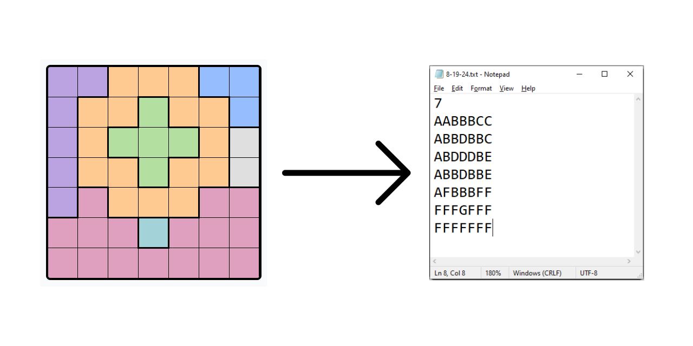

# LinkedIn Queens Solver
Recently, I have been having a lot of fun solving the daily [LinkedIn game "Queens"](https://www.linkedin.com/games/queens/) that came out a few months ago. Queens is based on the [N-Queens](https://en.wikipedia.org/wiki/Eight_queens_puzzle) a classic algorithmic challenge where the objective is to place N queens on an N×N chessboard such that no two queens can attack each other. LinkedIn Queens goes a step further by adding color to each tile, where there can only be one queen in each tile. I've always thought it would be a fun challange to write a program to solve this, but I recently found the time so here it is.

The program uses a backtracking algorithm, which systematically explores possible solutions and backtracks when a conflict is found.

## How to Use
1. Clone the repository:

`git clone https://github.com/SheedGuy/QueensSolver.git`

2. Compile the Java files:

`javac -d out -sourcepath src src/com/SheedGuy/queensSolver/*.java`

3. Run the program with the desired board configuration:

`java -cp out com.SheedGuy.queensSolver.Main <board-configuration-file>.txt`

## Creating Board Configuration Files

I have been creating these manually at this point. Takes about a minute, and I am not doing it very often. Obviously this is a bit tedious though, and is an improvement I plan to make in the future.

For now, though the input files are text files where the first line is N and the following N lines are each row of the puzzle, where a character coincides with color. For example:

## Next Steps
- [ ] Improve board input, using either OCR library or HTTP calls
- [ ] Improve the cli output (add color?)
- [ ] Further optimize to deccrease runtime on larger puzzles. This could be done with better pruning techniques, better underlying data structures, and/or implementing logic to actually play the game, rather than brute force.
